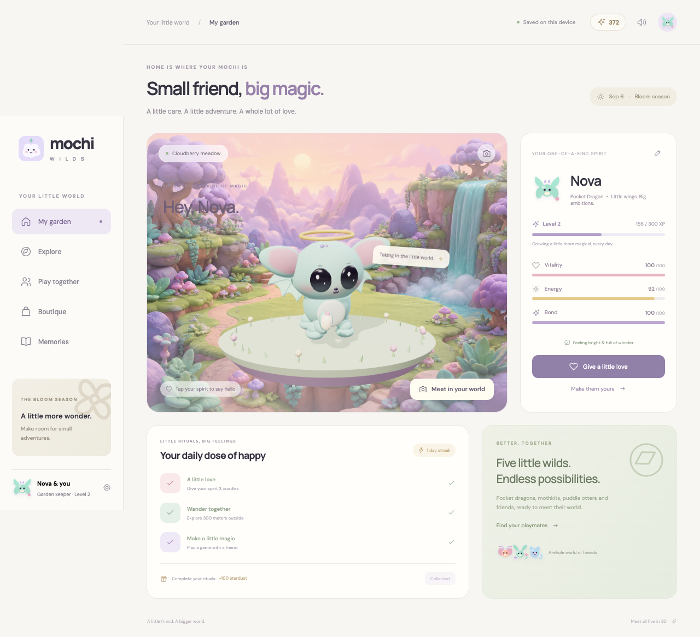

# Mochi Wilds

**A little friend. A bigger world.** An original virtual-pet mobile app starring five soft, expressive fantasy creatures. Adopt a pocket dragon, mothkit, jelly companion, leafy imp, or little comet spirit. Customize them, go walking, share affection, play with friends, and collect a little extra magic.



## Run it

Requires Node **22.12+** (tested with Node 25), npm, and a modern browser with WebGL. No API keys, paid accounts, database, or external backend setup required.

```bash
cd mochi-wilds
npm ci
npm run dev
```

Open **http://localhost:5173**. This starts both Vite and the multiplayer server. Create your spirit in the first-run dialog. Your pet and sandbox receipts are automatically saved on this device.

For a production build:

```bash
npm run build
npm start
```

Open **http://localhost:3001**. The Node server serves the entire build and WebSocket multiplayer. `PORT` changes its production port. `/api/health` is a health check. Deploy behind an HTTPS reverse proxy that forwards `/socket` WebSocket upgrades; one server process hosts all rooms. No third-party services are required.

## Meet the creatures in 3D

### A softer little personality

The companions now have fuller cheeks, lower-set warm eyes, and more compact head/body proportions. Puddle Otter has a milky mochi coat and cream belly. Cuddles unfold over 3.2 seconds: they notice you, lean in, squeeze their tiny paws, smile, and settle. Repeated cuddles alternate their lean and expression. Quiet moments include curious head tilts, double blinks, and sleepy eyelids; desktop pointer movement gently guides their gaze.

Try **Peekaboo** and **Say hello** in the garden or gallery. Peekaboo hides the face behind the paws, pauses, then opens into a happy reveal with a little voice. The ten creature calls are newly synthesized breathy vowel performances, with distinct pitches, rhythms, and purring textures for each species. Playback varies their delivery slightly. Mute, volume, background suspension, and reduced-motion preferences still apply. The gallery is the quickest place to judge the look, motion, and sound together.

Open **http://localhost:5173/creatures.html** for the interactive 3D gallery: Pocket Dragon, Mothkit, Puddle Otter, Bloom Imp, and Comet Ferret. Rotate each model, cuddle it, watch its signature trick, and hear its own voice. The same revised models appear in the garden, adoption/customization, and AR. The earlier concept artwork and soundboard remain at `/creature-lab.html` in development.

The latest models have continuous cheek surfaces with painted blush, inset glossy eyes, crescent-eye cuddle expressions, tiny smiles, padded ears, and smooth tails with real skinning. Pastel coats use soft sheen; the otter uses an opaque, softly glazed material. Breathing, blinking, head tilts, ear flops, paw steps, and species-specific tricks make them responsive. Offscreen gallery scenes suspend rendering; visible gallery scenes are limited to 30 fps. The garden retains its roaming controller.

Five self-contained **GLB files** are included in `public/assets/models/`, with **Idle, Walk, Signature, and Affection** animation clips. Download them from the gallery or import them into a glTF-compatible 3D editor. The live app generates its models from the same source, so no model downloads are needed to start playing. Regenerate exports after model edits with `npm run assets:models`.

The app includes **19 original sound effects**, including paired hello/happy voices for each creature, cuddle purrs, hops, spell cues, rewards, purchases, camera snaps, and button taps. Soft vowel formants give the revised creature calls a warmer vocal quality. Use the speaker button (also visible on mobile) for mute and volume. Preferences persist; sounds stop in the background. Playback starts only after a user gesture, and rate/concurrency limits keep repeated taps from becoming a wall of sound. The generated WAV assets are bundled for native/offline use.

The five approved companions are now implemented as articulated procedural 3D models in `src/creature-model.js`: Pocket Dragon, Mothkit, Puddle Otter, Bloom Imp, and Comet Ferret. They have separate rigs for legs, ears, wings, antennae, tails, fins, eyes, and accessories. `src/motion.js` gives each one a roaming controller with bounded garden targets, locomotion, an idle investigation state, a signature trick, affection response, and reduced-motion support. The same models are used in the garden, customization preview, and AR placement. Old saves migrate their previous Cloud/Star/Dew shapes to Dragon/Mothkit/Otter while keeping progress and purchases.

To regenerate them deterministically: `npm run assets:sounds`. Definitions: `src/sound-design.js`; playback: `src/audio.js`; generator: `scripts/generate-sounds.js`. No external recordings or sound-service credentials are used.

## Your spirit explores your actual room

AR is not a sticker on a camera feed. The app builds a model of the room it is in — walkable surfaces with real heights and semantic labels, obstacles, and measured ambient light — and the creature's roaming controller navigates that model instead of a fixed platform. It walks your floor, climbs onto your table, drops back down, walks out to a real edge and looks over it, ducks behind things, and curls up when the room is dark.

One interface, `RoomModel` (`src/room-model.js`), describes the room; two providers build it, so the behaviour is written once and every browser gets a version of it:

|           | `XRRoomProvider`                                             | `CameraRoomProvider`                                           |
| --------- | ------------------------------------------------------------ | -------------------------------------------------------------- |
| Where     | Android Chrome (WebXR)                                       | Every browser: desktop, iOS Safari, native                     |
| Surfaces  | Real `plane-detection` polygons with floor/table/seat labels | One ground plane the player places with a tap                  |
| Light     | `light-estimation` spherical harmonics and primary direction | Rec. 709 luminance and colour cast measured from camera frames |
| Placement | `hit-test` reticle                                           | Tap position, read as a depth cue                              |
| Stability | Runtime tracking state                                       | Sparse optical flow across a 16x12 luminance grid              |
| Occlusion | Per-pixel, from the real depth buffer                        | None                                                           |

Every WebXR feature beyond `hit-test` is requested as optional. A browser that refuses plane detection still gets a session, a synthesised floor around the placed spot, and honestly reduced confidence — and the behaviour layer responds to low confidence by keeping the creature close rather than marching it through furniture it cannot see. Sensed geometry also drives rendering (`src/room-view.js`): walkable surfaces become shadow catchers so the creature's shadow lands on your real table, walls become invisible depth-writing occluders, and where `depth-sensing` is granted the real world's depth is drawn into the depth buffer before the scene, so anything nearer than the creature — furniture, or a hand passed in front of the lens — hides it per pixel, and the key light follows the room's measured brightness and colour.

The garden is untouched. `WanderController` now takes a bounds strategy; the garden keeps its ellipse (`ELLIPSE_BOUNDS`) and AR passes a `RoomBounds` backed by the live model.

## A three-minute hackathon demo

1. Visit `/creatures.html` to meet all five companions, hear their voices, and try their tricks. Return to the garden and create **Lumi**, a mint Bloom Imp. Try the five species and five colors in the live 3D preview.
2. Tap your creature or **Give a little love** three times, with three seconds between cuddles. Watch its eyes smile, head tilt, and tail wag. Tap the garden ground to call it over.
3. Open **Explore → Try a demo walk**. Tap **Wander 100 m** three times, then finish. GPS mode is also implemented; the demo is clearly labeled.
4. Open **Play together → Play with a practice spirit**. Pick Spark, Bloom, or Bubble for three rounds. Then collect the daily ritual reward in My garden.
5. Open a second browser or an incognito window. Create another spirit, create a friend room on the first device, and join its six-character code on the second. Try a duel, then choose Harmony for a cooperative game.
6. Open **Boutique**, buy a Stardust halo using the sandbox confirmation, and return to the garden to see it equipped. Prism heart boosts care XP by 25%; Bloom crown and Moonlight garden change the look.
7. Try **Meet in your world**. Your spirit explores the room it is put in: it walks your real floor, climbs onto your table, hops back down, peers over real edges, and settles when the room goes dark. Use supported Android browser spatial AR, live camera mode (tap once to say where the floor is), or the camera-free 3D preview.
8. Tap the camera at the top of the garden. Open **Memories** to see your snapshot, walks, and games. Reload to demonstrate persistence.

## iOS and Android

Both native projects are included. Native apps bundle the whole web app and fonts, so care, customization, practice, the demo walk, memories, and sandbox purchases work without a server connection. Native walking uses Capacitor Geolocation. Native AR uses the camera-overlay mode; true plane tracking uses WebXR in supporting browsers.

### Android

Install Android Studio, Android SDK 35, and JDK 21. Open the included project:

```bash
npm run native:sync
npm run native:android
```

Select an emulator or physical device and Run in Android Studio. To build a debug APK directly:

```bash
cd android
# Android Studio creates local.properties; alternatively set ANDROID_HOME to your SDK.
./gradlew assembleDebug
```

**Android debug build verified successfully.** APK: `android/app/build/outputs/apk/debug/app-debug.apk`.
Camera and foreground location permissions are declared. GPS and camera hardware are optional so the interactive previews remain available on emulators.

### iOS

Requires macOS and Xcode with the iOS SDK. The included Xcode project uses **Swift Package Manager**, so CocoaPods is unnecessary.

```bash
npm run native:sync
npm run native:ios
```

Open `ios/App/App.xcodeproj` if needed. Allow Xcode to resolve packages, choose a signing team, select a simulator or device, and Run. Camera and location purpose strings are included. The bundle ID is `studio.mochi.wilds`; change it and your signing identity for distribution. Xcode is not installed in the development environment used to create this project, so the iOS binary has not been compiled here.

### Connecting two phones

For browser demos, use the same HTTPS deployment on both devices. Vite also prints a LAN address; LAN HTTP supports normal gameplay and multiplayer, but browsers generally require **HTTPS** for GPS, camera, and WebXR. Localhost is allowed for desktop testing.

For native apps, open **Play together → Connection settings** and enter the same HTTPS server address on each phone. You can also set `VITE_SERVER_URL` before building (see `.env.example`). Native apps default to local gameplay until a server is configured. The Android emulator can reach a host service at `10.0.2.2`, but use an HTTPS endpoint for the shipped native configuration; cleartext traffic is not enabled.

## Implemented behavior

| Feature            | Behavior                                                                                                                                                                                                                       |
| ------------------ | ------------------------------------------------------------------------------------------------------------------------------------------------------------------------------------------------------------------------------ |
| Original pets      | Five articulated fantasy creatures; five colors; editable name; owned accessories; glossy eyes, smiling expressions, soft ears, skinned tails, roaming, and individual tricks and voices.                                      |
| Daily care         | Three cuddles, 300 meters, one game; a one-time +100 stardust / +50 XP reward; UTC daily reset and consecutive-day streak.                                                                                                     |
| Growth and neglect | Vitality, energy, and bond slowly decay with elapsed time. XP begins declining after 24 hours without care, so levels can decrease. Stats stay bounded; spirits never die or show injury. Care restores stats.                 |
| Walks              | Foreground GPS distance with accuracy, speed, jitter, and stale-fix filtering. No route is transmitted. Explicit demo mode for indoor judging. Up to 5,000 meters credited per walk.                                           |
| Multiplayer        | Actual WebSocket rooms for two devices, server-resolved three-round duels or cooperative matching. Choices stay hidden until both commit. Heartbeats, room expiry, size/rate limits, full-room checks, and disconnect cleanup. |
| Solo play          | Randomized local practice spirit with the same rules and completion rewards.                                                                                                                                                   |
| Purchases          | Confirmable sandbox checkout, persistent idempotent receipts, restore from this device, automatic equip, permanent XP improvement. No real charge occurs.                                                                      |
| AR                 | WebXR surface hit-testing and tap placement on supporting devices; camera overlay with drag/resize fallback; interactive no-camera preview. Camera tracks stop on exit/background.                                             |
| Memories           | Garden photo composition, walk and game entries, a rolling 12-memory album persisted locally.                                                                                                                                  |
| Polish             | Original generated habitat and app icon, local fonts, adaptive desktop/mobile navigation, haptics, optional synthesized sounds, keyboard controls, focus trapping, reduced CSS motion.                                         |

Spell rules: **Spark outshines Bloom; Bloom outshines Bubble; Bubble outshines Spark.** Matching is a tie in duels and a shared point in Harmony. Everyone gets a friendship reward for completing a game.

## Architecture and assets

```text
src/
  main.js          UI, navigation, interactions, GPS, AR and multiplayer client
  pet.js           Three.js scenes, lighting, interaction and WebXR placement
  creature-model.js Articulated geometry, expressions, skinning and clip baking
  creature-studio.js Interactive 3D gallery, rotation and sound auditions
  creatures.js     Five-species registry and legacy shape mapping
  motion.js        Frame-independent roaming and species behaviour
  sound-design.js  Deterministic original voice and effect synthesis
  audio.js         Gesture-unlocked playback, mute, volume and voice limiting
  game.js          Pure care, decay, progression, purchases and duel rules
  storage.js       Local save/load and schema defaults
  icons.js         Original interface SVGs
  style.css        Responsive visual system
server/
  index.js         Production static server and WebSocket endpoint
  multiplayer.js   Authoritative room and round state machine
  dev.js           Combined local server + Vite development runner
public/assets/
  habitat.png      Original AI-generated clay world artwork
  app-icon.png     Original AI-generated fantasy spirit app icon
  icon.svg         Code-native spirit brand mark
  models/          Five animated GLB exports
  sounds/          Nineteen generated PCM WAV effects
scripts/
  export-creatures.js Rebuild portable GLB models with animations
  generate-sounds.js  Rebuild original sound assets
android/           Complete Capacitor Android project
  app/src/main/AndroidManifest.xml   Camera / location permissions
ios/               Complete Capacitor iOS + SwiftPM project
  App/App/Info.plist                 Permission descriptions
  App/CapApp-SPM/Package.swift       Native dependencies
tests/             Domain, real socket, and browser integration tests
```

The creature geometry, materials, face, skeleton, and wearables are generated in `creature-model.js`; the platform and lighting live in `pet.js`. No remote assets are required at runtime. The original bitmap artwork was generated for this app. Fonts are bundled from Fontsource; their licenses are in `node_modules/@fontsource/*/LICENSE`.

Stack rationale: [Three.js](https://threejs.org/docs/pages/ARButton.html) supports a single interactive pet renderer in the garden and WebXR; [Capacitor](https://capacitorjs.com/docs) packages the same app for both mobile platforms. Small pure game functions make offline care deterministic and testable. A compact Node/WebSocket server provides real cross-device play without account setup.

## Verification

```bash
npm test            # care/decay, purchases, GPS, and real two-client socket tests
npm run test:e2e    # browser adoption-to-purchase journey, mobile/AR preview, live room
npm run build      # production assets
```

The browser suite uses installed Google Chrome by default. Alternatively:

```bash
npx playwright install chromium
PLAYWRIGHT_CHANNEL=chromium npm run test:e2e
```

The checks cover care and purchases, save migration, real multiplayer sockets, frame-independent movement, sound assets and limiting, rig/expression transforms, GLB loading and animation, mobile layouts, and browser gameplay. The creature gallery suite also captures desktop and mobile close-ups and exercises all five cuddle/trick/voice combinations.

Room sensing is covered at every tier: the geometry, behaviour, bounds, and camera-frame analysis are unit tested (`tests/room-*.test.js`, `tests/camera-room.test.js`), and `tests/e2e/ar-room.spec.js` drives the camera tier end to end against Chrome's synthetic webcam. The WebXR provider's plane, light, and depth handling needs a real device.

Browser screenshots are written to `test-results/garden-desktop.png`, `test-results/garden-mobile.png`, `test-results/creature-lineup-3d.png`, and individual `test-results/creature-*.png` close-ups. Physical-device GPS, camera permissions, and spatial AR need a compatible phone to verify; headless tests exercise the no-camera fallback. Native code and permissions are included; see platform build results above.

## Deliberate hackathon boundaries

This is a complete playable demo with a real room server, **local device saves**, and a **sandbox purchase provider**. It does not claim App Store / Play Billing integration, receipt validation against stores, cloud accounts, cross-device pet sync, native ARKit/ARCore plane tracking, background pedometer service, or durable multiplayer rooms. Server restarts close friend rooms; personal progress remains on each device. Clearing browser/app storage clears that device’s save and receipts. Game XP and purchases are local, so this is not a tamper-resistant real-money economy.

To commercialize: replace `purchase()` with a StoreKit/Play Billing adapter and server receipt verification, add authenticated durable pet storage, and validate reward grants server-side. The current sandbox is intentionally runnable without those services. The current app only uses device foreground location and never uploads camera frames or routes.
